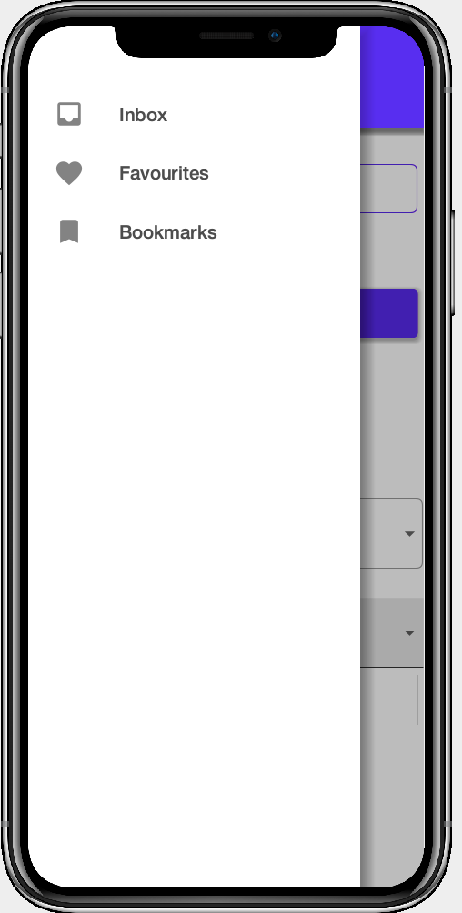

= Codename One Material Theme Sandbox

This is a testbed for developing a new Material theme for Codename One.  The theme itself is located in link:common/src/main/css/theme.css[theme.css].

== Goals of this theme

. Pure CSS
. No image resources required.
. Support for dark mode
. Material color palette support using CSS variables.
. Does not depend on the native theme.

== State of the Project

*Under Development*

Some of the basic components are styled such as TextField, Button, ComboBox, but there is still much to do.

=== Using the Theme

If you want to use this theme in your own project, you can simply copy the theme.css file into your project's common/src/main/css directory.

TIP: If you're new to Codename One, you can create a new maven project at https://start.codenameone.com

==== Customizing Color Palette

The theme colors are defined as CSS variables in the `#Constants` section at the top of the theme.css file:

[source,css]
----
#Constants {
    /* ... */
    --primary: 98, 0, 238;
    --primaryVariant: 55, 0, 179;
    --secondary: 3,218,198;
    --secondaryVariant: #018786;
    --background: 255, 255, 255;
    --surface: 255, 255, 255;
    --error: #b00020;
    --on-primary: 255, 255, 255;
    --on-secondary: 0,0,0;
    --on-background:0,0,0;
    --on-surface: 0,0,0;
    --on-error: 0,0,0;

}
----

These colors follow the https://material.io/design/color/the-color-system.html#color-theme-creation[material design color system].

The variable definitions:

--primary::
The color displayed most frequently across your app's screens and components.

--primaryVariant::
A darker version of the primary color used to distinguish parts of the UI from the primary color.

--secondary::
A secondary color provides more ways to accent and distinguish your product. Having a secondary color is optional, and should be applied sparingly to accent select parts of your UI.
+
If you don’t have a secondary color, your primary color can also be used to accent elements.
+
Secondary colors are best for:
+
. Floating action buttons
. Selection controls, like sliders and switches
. Highlighting selected text
. Progress bars
. Links and headlines

--secondaryVariant::
A darker version of the secondary color used to distinguish parts of the UI from the secondary color.

--background::
Aappears behind scrollable content. The baseline background and surface color is #FFFFFF.

--surface::
Surface colors affect surfaces of components, such as cards, sheets, and menus.

--error::
Error color indicates errors in components, such as invalid text in a text field. The baseline error color is #B00020.

--on-primary::
Color that appears on top of surfaces that use the _primary_ color.

--on-secondary::
Color that appears on top of surfaces that use the _secondary_ color.

--on-background::
Color that appears on top of surfaces that use the _background_ color.

--on-surface::
Color that appears on top of surfaces that use the _surface_ color.

--on-error::
Color that appears on top of surfaces that use the _error_ color.

==== Styles

==== Buttons

|===
|UIID |Image

|OutlinedButton
| 

|Button
| 

|ContainedButton
| 
|===

==== ComboBoxes

|===
|UIID |Image

|ComboBox
| 

|OutlinedComboBox
| image:images/OutlinedComboBox.png[]

|===

==== Toolbar

==== SideBar

== Building from Source

1. Clone this repository
2. Open the link:pom.xml[] file, and modify the `cn1.version` and `cn1.plugin.version` properties to point to the latest version of Codename One.  At time of writing that is 7.0.38.  Altenatively you can clone the https://github.com/codenameone/CodenameOne[Codename One repo], and https://github.com/codenameone/CodenameOne#quick-start-with-maven[build it from source using Maven], and keep the version numbers unchanged (8.0-SNAPSHOT).
3. Open this project in IntelliJ.
4. Run the "Run in Simulator" run configuration.

== Contributing

There are many components left to style.  If you style them in the theme.css, please send a pull request.

